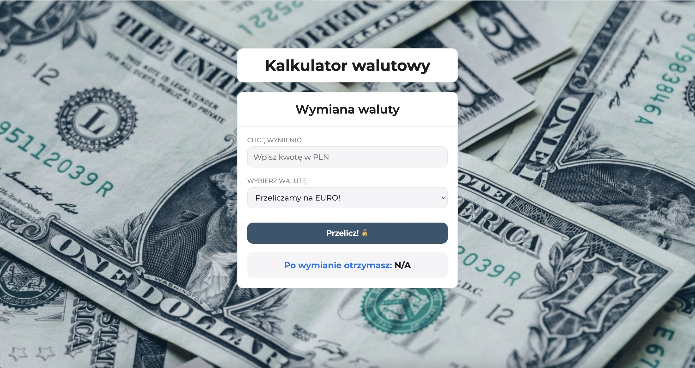

# Currency Converter

## Demo

https://kam-bar.github.io/currency-converter-react

## Description

Simple currency converter application (PLN → EUR/GBP/USD) built with React.

## Technologies

- HTML
- CSS (BEM)
- JavaScript (ES6+)
- React
- Create React App
- GitHub Pages

## Available Scripts

In the project directory, you can run:

### `npm start`

Runs the app in the development mode.

### `npm run build`

Builds the app for production to the `build` folder.

### `npm run deploy`

Deploys the app to GitHub Pages.